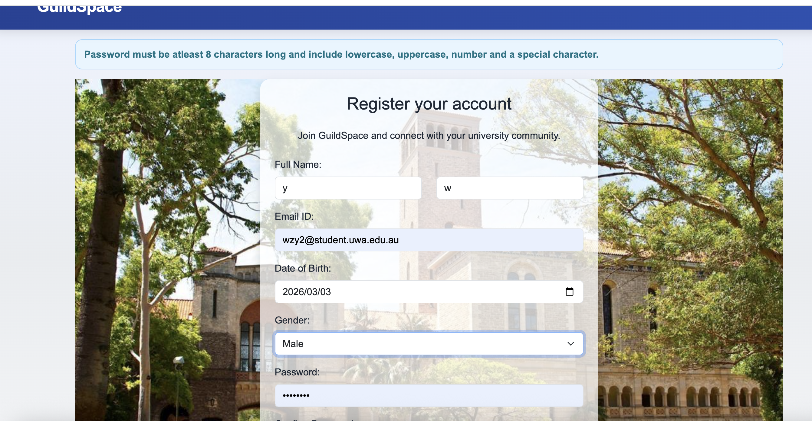
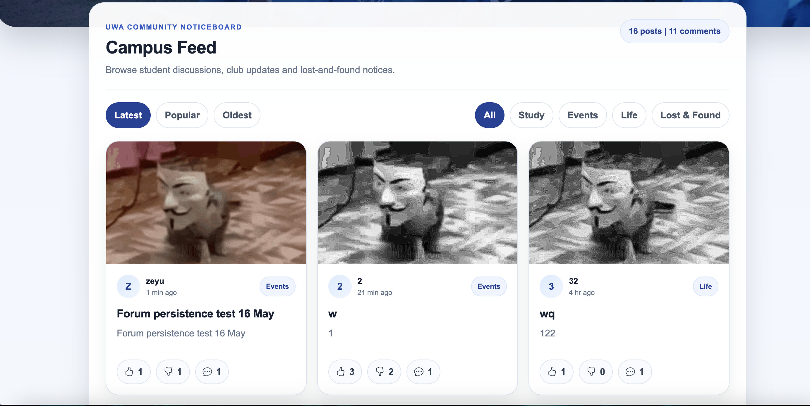
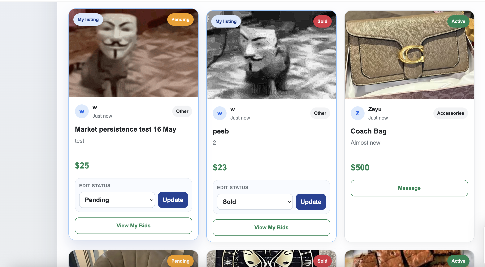
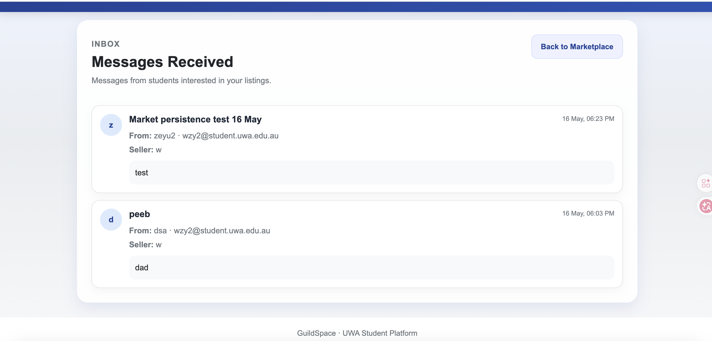
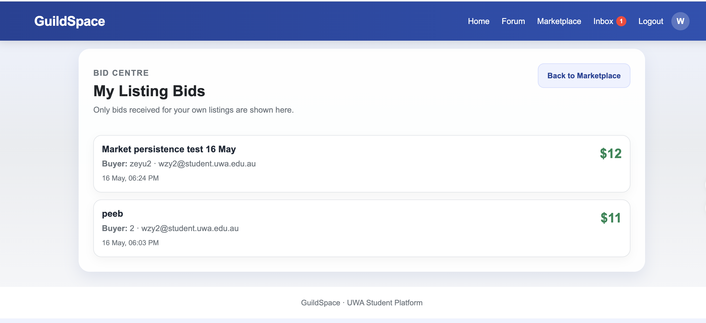

# Testing Evidence

Manual regression testing was completed on the latest `main` branch.

## Environment

- Local server: `python3 app.py`
- Browser: Chrome
- Database: SQLite with SQLAlchemy

## Manual Testing

### Register validation

Tested register form validation, including password requirement checking.

### Home page navigation

Tested homepage layout, clickable cards, Get Started button, and footer display.

### Forum persistence

Tested forum post creation, like/dislike, comment, refresh, and server restart persistence.

### Marketplace persistence

Tested marketplace listing creation, status update, refresh, and server restart persistence.

### Message seller

Tested two-account message seller flow and confirmed the seller can view messages in Inbox.

### Place bid

Tested two-account bid flow and confirmed the seller can view bids in the Bids page.

## Result

All core manual testing flows passed.